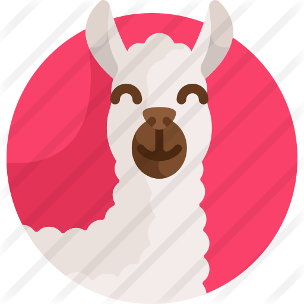
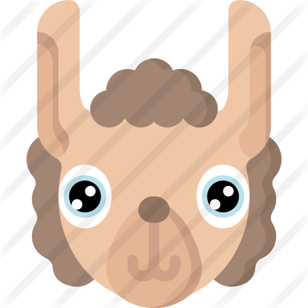
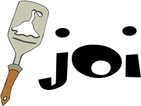
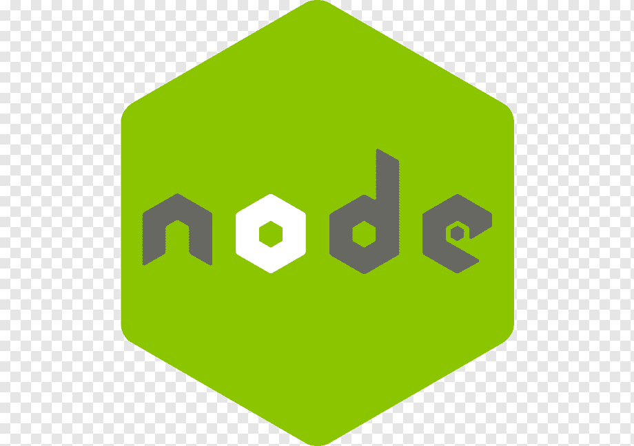
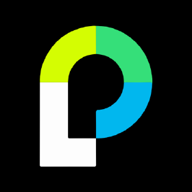
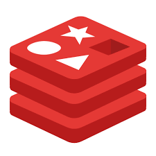

[![Contributors][contributors-shield]][contributors-url]
[![Forks][forks-shield]][forks-url]
[![Stargazers][stars-shield]][stars-url]
[![Issues][issues-shield]][issues-url]
[![MIT License][license-shield]][license-url]

<!-- PROJECT LOGO -->
 

  

  <h3 align="center">LAMA WALLET PROJECT</h3>

  

    An awesome online wallet API created by CoStyle Studio
     
    <a href="https://github.com/RomanKonopelko/CoStyle_Backend"><strong>Explore the docs »</strong></a>
     
     
    <a href="https://github.com/RomanKonopelko/CoStyle_Backend">View Demo</a>
    ·
    <a href="https://github.com/RomanKonopelko/CoStyle_Backend/issues">Report Bug</a>
    ·
    <a href="https://github.com/RomanKonopelko/CoStyle_Backend/issues">Request Feature</a>
  

<!-- TABLE OF CONTENTS -->

  
Table of Contents

  <ol>
   <li>
      <a href="#team">Lama Team</a>
      <ul>
    <li>
      <a href="#about-the-project">About The Project</a>
      <ul>
        <li><a href="#built-with">Built With</a></li>
      </ul>
    </li>
    <li><a href="#usage">Usage</a></li>
    <li><a href="#roadmap">Roadmap</a></li>
    <li><a href="#contributing">Contributing</a></li>
    <li><a href="#license">License</a></li>
    <li><a href="#contact">Contact</a></li>
    <li><a href="#acknowledgements">Acknowledgements</a></li>
  </ol>

<!-- ABOUT THE PROJECT -->

## Lama Team

# Backend/Teamlead

# Frontend

-Scrum Master

-Lama UI team:

## About The Project

[![Lama Wallet home][home-screen]](https://costyl-swiss-wallet.netlify.app/home)

We created an Lamawesome online Wallet application, that easly will help you to keep an eye on your income and money consumptions. Light and fluff UI and usage that easy to understand!

[![Lama Wallet manager][lama-screen]](https://costyl-swiss-wallet.netlify.app/home)

If having any issues with our API, Lama Manager is always ready to help.

[![Lama Wallet transactions][transactions-screen]](https://costyl-swiss-wallet.netlify.app/home)

We implemented full CRUD logic to operated with the transactions:

-Easly create!
-Easly read!
-Easly delete!
-Easly update!

[![Lama Wallet balance][balance-screen]](https://costyl-swiss-wallet.netlify.app/home)

All the transactions are syncronized, so you can notice all the balance changes after the transaction has been made. You can see the current user balance, and the staged balance caches right after the transaction was created!

### Built With

This section should list any major frameworks that you built your project using. Leave any add-ons/plugins for the acknowledgements section. Here are a few examples.

## Backend

Talking about what is going on under the skin?

Our backend has two databases connected! We decided to use MongoDB to organize user and transactions collections. And Redis cache database to work with our tokens.

By the way. Security is also matters. So using the power of Redis we made token caching and blacklisting system that helps us to prevent using twice the same tokens in the system.

## Roadmap

See the [open issues](https://github.com/RomanKonopelko/CoStyle_Backend/issues) for a list of proposed features (and known issues).

## License

Distributed under the MIT License. See `LICENSE` for more information.

<!-- CONTACT -->

## Contact

Project Link: [https://costyl-swiss-wallet.netlify.app/home](https://costyl-swiss-wallet.netlify.app/home)

<!-- ACKNOWLEDGEMENTS -->

<!-- MARKDOWN LINKS & IMAGES -->

[home-screen]: https://github.com/RomanKonopelko/CoStyle_Backend/assets/screenshots/home.png
[balance-screen]: assets/screenshots/balance.png
[lama-screen]: https://github.com/RomanKonopelko/CoStyle_Backend/feature/gmailAPI/assets/screenshots/lama.png
[transactions-screen]: https://github.com/RomanKonopelko/CoStyle_Backend/feature/gmailAPI/assets/screenshots/transactions.png
[contributors-shield]: https://img.shields.io/github/contributors/RomanKonopelko/CoStyle_Backend.svg?style=for-the-badge
[contributors-url]: https://github.com/RomanKonopelko/CoStyle_Backend/graphs/contributors
[forks-shield]: https://img.shields.io/github/forks/RomanKonopelko/CoStyle_Backend.svg?style=for-the-badge
[forks-url]: https://github.com/RomanKonopelko/CoStyle_Backend/network/members
[stars-shield]: https://img.shields.io/github/stars/RomanKonopelko/CoStyle_Backend.svg?style=for-the-badge
[stars-url]: https://github.com/RomanKonopelko/CoStyle_Backend/stargazers
[issues-shield]: https://img.shields.io/github/issues/RomanKonopelko/CoStyle_Backend.svg?style=for-the-badge
[issues-url]: https://github.com/RomanKonopelko/CoStyle_Backend/issues
[license-shield]: https://img.shields.io/github/license/RomanKonopelko/CoStyle_Backend.svg?style=for-the-badge
[license-url]: https://github.com/RomanKonopelko/CoStyle_Backend/blob/master/LICENSE.txt
